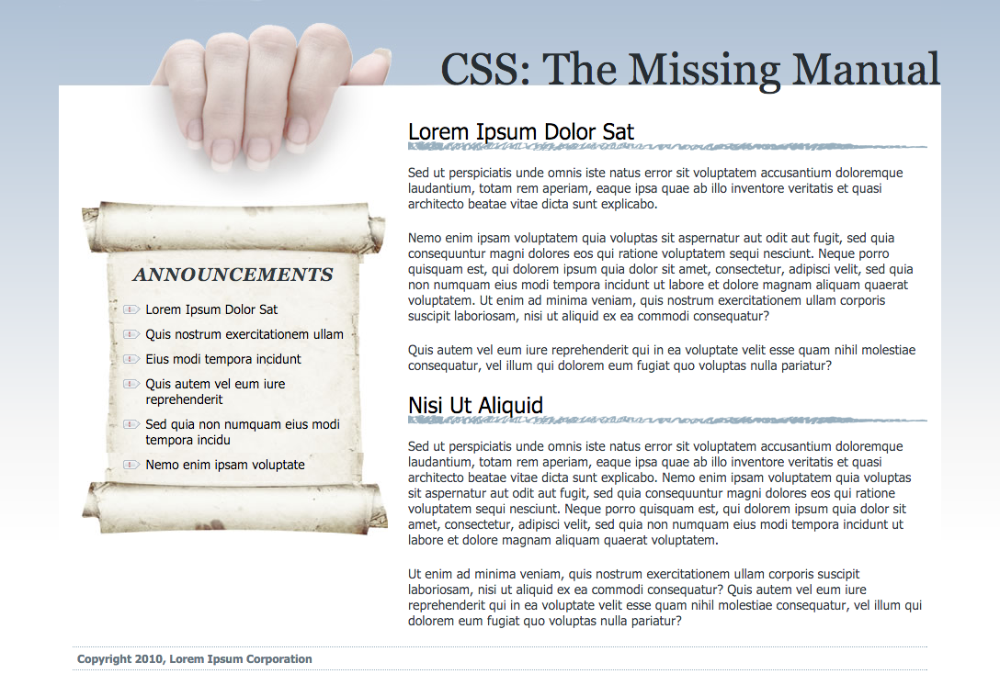

# Challenge: Images

##1. Image

Add `figure` and `figcaption` tags to HTML and proper CSS styles so `01_image_ex/image.html` appears in the browser with the following design.  

_Note: add proper classes to the HTML if needed_  
_Hint: styles for `figure`, `figure img`,  `figcaption` should be enough_

##2. Gallery

Add and proper CSS styles so `02_gallery_ex/gallery.html` appears in the browser with the following design.  

_Note: add proper classes to the HTML if needed_  
_Hint: styles for `figure`, `figure img`,  `figcaption` should be enough_

##3. Backgrounds

Add and proper CSS styles so `03_bg_ex/bg_images.html` appears in the browser with the following design.  

_Note: add proper classes to the HTML if needed_  

