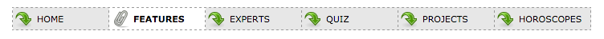

# Challenge: Links & Nav Bar

##1. Links

Add the proper CSS styles so the links at `links/links.html` appears in the browser with the following design.  

_Note: add proper classes to the HTML if needed_  
_Hint: use selectors and pseudo-selectors such as `.resources a[href^='http://']`, `.resources a[href$='.pdf']`,  `a[href^="mailto:"] ` and `a:visited`_

##2. Nav Bar

Add the proper CSS styles so `nav_bar/nav_barlinks.html` appears in the browser as the following nav bars (vertical & horizontal)

_Note: add proper classes to the HTML if needed_  

Vertical Navigation Bar  

Horizontal Navigation Bar  
