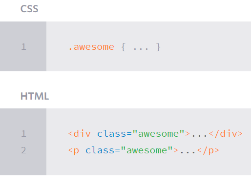
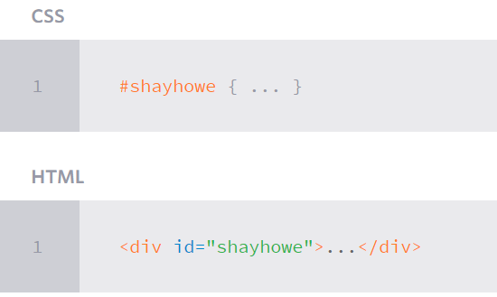
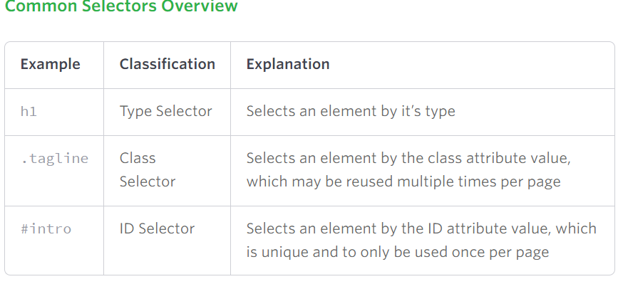
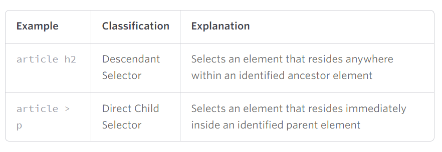
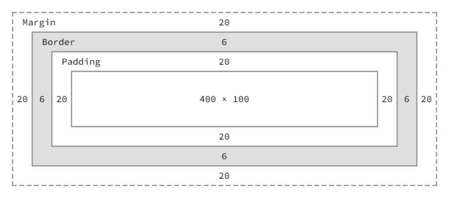
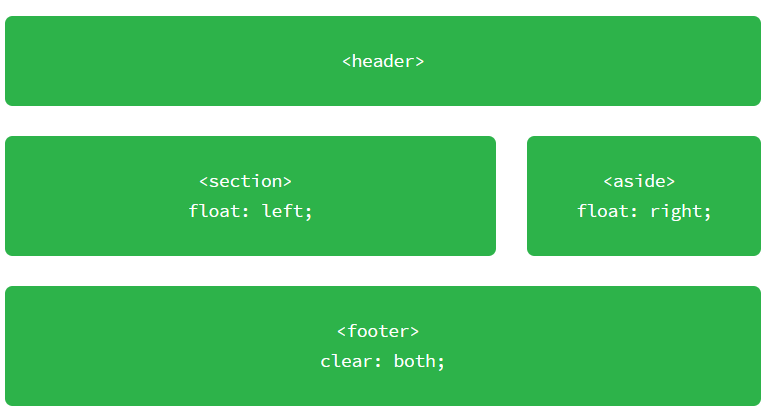

#Today 18.04

# [CSS3](https://skylabcoders.github.io/bootcamp-abril2017/?full#css3)
##CSS3 Basics & Selectors

Is the layer of the presentation and design.

El css se construye con una serie de reglas donde definimos
un selector y una serie de pares (propiedad y valor).

*There are three ways* 
1.  In line of HTML document, no recomended
2.  Tag style into HTML document
3.  Recomended, link file extern


-   selector propiedad:valor (*``p {color:red}``*)
    
**Type Selectors**
-   Tags elements of the HTML
    
**Class Selectors**
-   Dot selector  (``.``) select particular group of elements.
     
**Id selectors**
    + Class selector (``#``) Only select the element containing the id attribute value.
     

---

**The diferences between**:
-   The id should be unique. Only one description for once.
-   The class are share.

##Specificity 
*(preferences into CSS3)*
The first is in cascade, after the ID, class and tag.

[Specificity Calculator](https://specificity.keegan.st/)


#Complex Selectors

[Common Selector overview](http://learn.shayhowe.com/advanced-html-css/complex-selectors/)



**Child Selectors Overview**



**Sibling Selectors Overview**


##CSS3 Properties & Values

[CSS3 Properties & Values](https://skylabcoders.github.io/bootcamp-abril2017/?full#83):
-   Fonts:
    +   Working with Typography   
    +   Font Family:(``font-family:``)
    +   Color text:(``color:``)
    +   Font Weight
    +   ...

##CSS3 Positioning
[link to slide](https://skylabcoders.github.io/bootcamp-abril2017/?full#85)

**The Box Model** is the sum of width, height, padding, margin, border.


- Using the formulas, we can find the total height and width of our example code.

**Width**: 492px = 20px + 6px + 20px + 400px + 20px + 6px + 20px
**Height**: 192px = 20px + 6px + 20px + 100px + 20px + 6px + 20px

Natural flow empujara al resto de cajas.
Width display command you can modify his possition

Los elementos de bloque ocupan el 100% y saltan de linea empujando el resto de elementos.
Display hibryd for modifed things. ``display: inline-block`` coloca cada bloque en linea (uno al lado del otro).

Después tenemos otro importante que es el ``float`` hacemos que el texto flote alrededor. Sirve para posicionar cajas en el layout.

[Exercises](https://skylabcoders.github.io/bootcamp-abril2017/?full#95)

[Solutions](HTML5+CSS3 Challenges/2-selectors/material)

##Float

[Ejemplos](http://learn.shayhowe.com/html-css/positioning-content/) float:



*codigo*:

```css
}
header,
section,
aside,
footer {
  margin: 0 1.5% 24px 1.5%;
}
section {
  float: left;
  width: 63%;
}
aside {
  float: right;
  width: 30%;
}
footer {
  clear: both;
  margin-bottom: 0;
}
```


