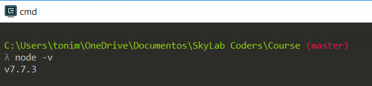
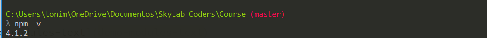

## Today 08.05

**[Node JS](https://skylabcoders.github.io/bootcamp-abril2017/?full#207)**

After the last week where did the our project group and the end of the Frontend session, now in the middle of the course we start with Backend.

For check the version installed you must put in terminal **cmder**: 
 ``node -v``

 

For run our script app, writte ``node app.js`` in terminal **cmder**.

Install [nodemon](https://nodemon.io/) with this command: ``npm install -g nodemon``.

*work similar as node -v but still waiting for news change. Like LiveReload*.
For run app with this usefulled is ``nodemon app.js``.

Node sirve para ejecutar javascrip en un servidor.
[Sistema de modulos](https://darrenderidder.github.io/talks/ModulePatterns/#/) 

``require`` key work node.js for require different files, call other files. Requiere command is an object.

Remember the differents forms to created [objects in JS.](remember create objets in JS.js
)

[demo-modules-text](demo-modules-text)
[demo-modules-node](demo-modules-node)

### [NPM](https://skylabcoders.github.io/bootcamp-abril2017/?full#208)

NPM --> Package module

For install any package, must we writte ``npm install namepackage`` when I installed the module, this will create a new folder with the name **node_modules** into our project.

When no specify the path on require command, automatically search into folder node_modules of our project.

Exercises for practice [Node](https://skylabcoders.github.io/bootcamp-abril2017/?full#213)

**Exercises examples**:

*   [Demo Modules Text](Demo Modules Text)
*   [Demo Modules Node](Demo Modules Node)
*   [Calculator Node](Calculator Node)

