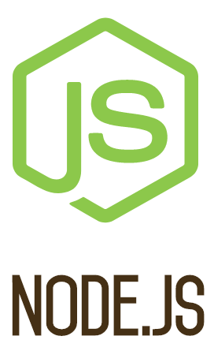

## Today 09.05

**[Node JS](https://skylabcoders.github.io/bootcamp-abril2017/?full#207)**




Mejoramos la app [operations](Calculator Node) y la modificamos para recoger directamente argumentos desde Node

If we want ignored any file for Git, must be create a file whit the name ``.gitignore`` and into put the name of the folders and files for ignore the Git

Si introducimos en consola el comando ``env``, obtenemos todas las variables de entorno de nuestro sistema operativo y podemos leerla mediante Node.

Por ejemplo con el ``set MY_name=Toni&&node app.js`` podremos modificar alguna variable de entorno que hemos visto anteriormente.

Lo podremos ver si en nuestra app escribimos un console.log, como el siguiente.
``console.log(process.env)`` y veremos como la variable de entorno a cambiado al lanzar el comando 
// ``set MY_NAME=Toni&&node app.js``

Now checked the next exercise [Node Exercises](Node Exercises). In this exercises up the litle server listening on port that in the moment of launch the app is specificy in the moment you call the node app. On windows with the next command ``set PORT=3000&&node app.js``

### [Modulos node (require)](https://github.com/juanmaguitar/apuntes-nodejs/blob/master/modulos/modulos-node-required.md)

-   [http](https://nodejs.org/api/http.html#http_http)
-   [url](https://nodejs.org/api/url.html)
-   [path](https://nodejs.org/api/path.html)
-   [fs](https://nodejs.org/api/fs.html#fs_file_system)
-   [util](https://nodejs.org/api/util.html#util_util)

### [HTML Code](https://github.com/juanmaguitar/js-server-exercises/tree/master/node-exercises#3-html-code)

Modulo [request](https://github.com/request/request)

1.  Generate the file *package.json* with this command in console ``npm ini`` 
2.  Install dependencies, ``npm install request`` if add the command ``--save`` automaticaly update the package.json with the new package.
3.  Create the file for request HTML webpages:

```javascript
var request = require('request')
request('http://www.google.com', function (error, response, body) {
  console.log('error:', error) // Print the error if one occurred
  console.log('statusCode:', response && response.statusCode) // Print the response status code if a response was received
  console.log('body:', body) // Print the HTML for the Google homepage.
})
```

### Exercices

**Exercises** : [Node Exercises Folder](Node Exercises)
**Exercises** : [Connection to the server](Node Exercises/01 - Connection to the server)
**Exercises** : [Show Content](Node Exercises/02 - Show Content)
**Exercises** : [HTML Code](Node Exercises/03 - HTML Code)
**Exercises** : [File list](Node Exercises/04 - File list)
**Exercises** : [Writing on txt](Node Exercises/05 - Writing on txt)
**Exercises** : [Demo Async examples](Demo Async examples)

[Request - Simplified HTTP client](https://github.com/request/request)

**Exercises**: [Demo Get Url Request](Demo Get Url Request)


Practice with node [https://nodeschool.io/](https://nodeschool.io/)

``npm install learyounode``

[Learn You Node](Learn You Node)

## Asynchronous programming in Node

- Video | [Understanding asynchronous tasks](https://www.linkedin.com/learning/learning-node-js/understanding-asynchronous-tasks)
- Article | [Asynchronous Code Design With Node.js](https://shinesolutions.com/2011/08/26/asynchronous-code-design-with-node-js/)
- Tutorial | [Short Intro to Node](https://github.com/maxogden/art-of-node#callbacks)

