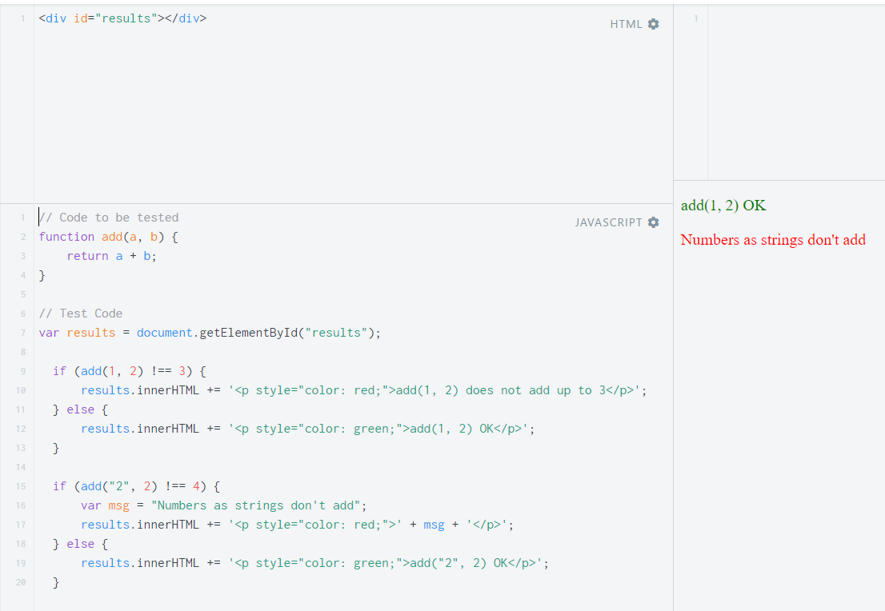

## Today 13.05 

### [TDD](https://skylabcoders.github.io/bootcamp-abril2017/?full#58)

- [Unit Testings](https://github.com/juanmaguitar/javascript-notes/tree/master/markdown-en/07-TDD#1--unit-testings)
- [TDD y BDD](https://github.com/juanmaguitar/javascript-notes/tree/master/markdown-en/07-TDD#2--tdd-y-bdd)
- [Testing Frameworks](https://github.com/juanmaguitar/javascript-notes/tree/master/markdown-en/07-TDD#3--testing-frameworks)
- [Testing Runners](https://github.com/juanmaguitar/javascript-notes/tree/master/markdown-en/07-TDD#4--testing-runners)

The main idea is start the program doing a test

- The Unit testing **-->** codigo que comprueba que otro código tiene que hacer lo que debe de hacer.

Ejemplos test:

```javascript
function(sum) {
  const msg = "hola"
  return [a + b, msg]
}
```
--> Testing ex for check the code above.
```
typeof sum === function
sum(2, 5)[0] === 7
sum(2, 5)[1] === "hola"
```

Example the Unit testing. [This example](https://jsfiddle.net/juanma/ahL6bogg/) is very simple but illustrate several things about unit testings:

1. The function is tested from several angles (we check what the function returns when passing different types of data to it)
1. We compare the returned value with an expected value
1. If these values match we show a green OK
1. If these values doesn't match we show an error message to help us locate the problem



### BDD

especializado en testear en vez del codigo como el TDD este se enfoca en testear partes de la app.

### [Testing Frameworks](http://en.wikipedia.org/wiki/List_of_unit_testing_frameworks#JavaScript)

The most populars [Jasmine](https://jasmine.github.io/) ([slide here](https://skylabcoders.github.io/bootcamp-abril2017/?full#59)), [QUnit](http://qunitjs.com/), [Mocha](http://mochajs.org/), etc...

Now practice with **Jasmine**. Download Jasmine [here](https://github.com/jasmine/jasmine/releases) and follow the instructions of teacher

Some [**matchers**](https://github.com/pivotal/jasmine/wiki/Matchers) that Jasmine offer by default (we can build our own) are:

- `expect(x).toEqual(y);`  
_compares objects or primitives `x` and `y` and passes if they are equivalent_

- `expect(x).toBe(y);`  
_compares objects or primitives `x` and `y` and passes if they are the same object_

- `expect(x).toMatch(pattern);`  
_compares `x` to string or regular expression `pattern` and passes if they match_

- `expect(x).toBeDefined();`  
_passes if `x` is not `undefined`_

- `expect(x).toBeUndefined();`  
_passes if `x` is `undefined`_

- `expect(x).toBeNull();`  
_passes if `x` is `null`_

- `expect(x).toBeTruthy();`  
_passes if `x` evaluates to `true`_

- `expect(x).toBeFalsy();`  
_passes if `x` evaluates to `false`_

- `expect(x).toContain(y);`  
_passes if array or string `x` contains `y`_

- `expect(x).toBeLessThan(y);`  
_passes if `x` is less than `y`_

- `expect(x).toBeGreaterThan(y);`  
_passes if `x` is greater than `y`_

- `expect(function(){fn();}).toThrow(e);`  
_passes if function `fn` throws exception `e` when executed_

### Kata 

For practice TDD in slide [62](https://skylabcoders.github.io/bootcamp-abril2017/?full#62)

[Drink Beer](Drink20%Beer)

For practice TDD in slide [63](https://skylabcoders.github.io/bootcamp-abril2017/?full#63)


**Overcomplexity** (*overcomplexity programming*)

[Grade Book](Grade20%Book)


