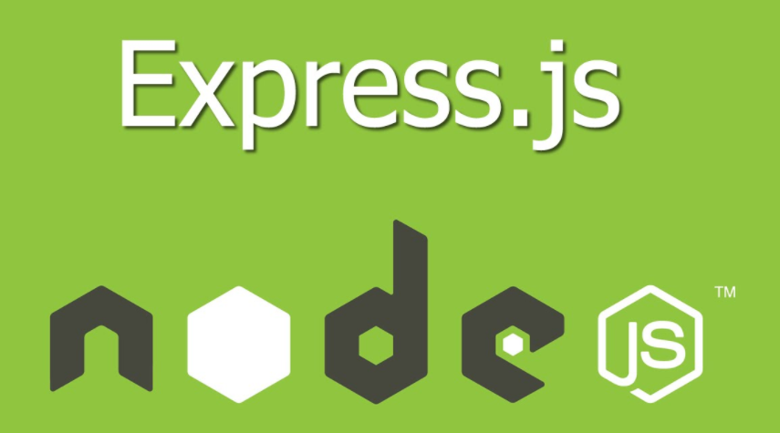
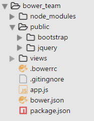

## Today 15.05



Expres es un Framework de los más extendidos de Node.js.
[Here](http://www.nodehispano.com/2012/01/express-el-framework-web-para-nodejs/) more information:

### First Steps

1. [Installing Express](http://expressjs.com/en/starter/installing.html)
1. [Hello world example](http://expressjs.com/en/starter/hello-world.html)
1. [Express application generator](http://expressjs.com/en/starter/generator.html)
1. [Basic routing](http://expressjs.com/en/starter/basic-routing.html)
    + [GET](https://en.wikipedia.org/wiki/Hypertext_Transfer_Protocol#Request_methods)
        * Only read. Request a representation of the specified resource
    + [POST](https://en.wikipedia.org/wiki/Hypertext_Transfer_Protocol#Request_methods)
        * Send information
    +   [PUT](https://en.wikipedia.org/wiki/Hypertext_Transfer_Protocol#Request_methods)
        *   add and update the information 
    +   [DELETE](https://en.wikipedia.org/wiki/Hypertext_Transfer_Protocol#Request_methods)
        *   Erase the id 
1. Serving static files in Express


**Nodemon** for we can the change in realtime ``nodemon app.js``

``SET DEBUG=second-express-project:* & npm start``


### CURL

With [CURL](http://stackoverflow.com/questions/9507353/how-do-i-install-set-up-and-use-curl-on-windows#16216825) you can simulate petitions from the command line.
With [PostMan](https://chrome.google.com/webstore/detail/postman/fhbjgbiflinjbdggehcddcbncdddomop), you can simulate petitions from visual environment.

### [bower](https://bower.io/)


Bower can manage components that contain HTML, CSS, JavaScript, fonts or even image files. Front-end dependencies.

**Steps** for start the new project:

1. Creamos directorio vacio para el proyecto ``mkdir new_project``. 
1. ``npm install bower -g`` install manage package (sino lo tienes ya instalado en el pc, **solo una vez**.)
1. ``npm init`` --> para generar el archivo package.json ``--y`` para que no te pregunte.
1. ``npm install express`` --> Install packages con ``--save`` lo escribe ademas en el archivo json.
1. ``touch .bowerrc`` e indicamos las rutas donde vamos a instalar las dependencias de bower
1. ``touch .gitignore``
1. ``bower init`` --> para generar el archivo package.json ``--y`` para que no te pregunte.
1. ``bower install pug`` --> Install packages con ``--save`` lo escribe ademas en el archivo json.
1. ``bower install boostrap`` --> Install packages con ``--save`` lo escribe ademas en el archivo json.
1. ``npm install pug --save`` 

código de ejemplo para empezar un nuevo proyecto app.js:

```javascript
const express = require('express')
const app = express() // creamos la instancia
const PORT = 3000

app.set('view engine', 'pug')
app.use(express.static('public')) // solo cuando necesitemos servir archivos estaticos

app.get('/', (req, res) => {
  res.render('index') // siempre buscará en carpeta views/index.pug  
})

app.listen(PORT, () => console.log(`Example app listening on port ${PORT}`))
```

Y dentro de la carpeta (sino lo tenemos la creamos) **views** ponemos el index.pug
Quedando la estructura de la siguiente manera.



Si lo queremos customizar el directorio de instalación de bower components, debemos de crear un archivo ``.bower.rc`` y dentro ponemos el nuevo directorio siguiendo este patrón.

```javascript
{
    "directory": "public"
}
```

### Exercices

- [bower](bower)
- [Express_Boostrap_content](Express_Boostrap_content)
- [Express_Boostrap_local_content](Express_Boostrap_local_content)
- [Express_dinamic_content](Express_dinamic_content)
- [First_Express_Project](First_Express_Project)
- [bower_team/](bower_team)


