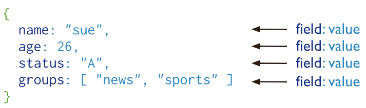

# Today 22.05

[](https://skylabcoders.github.io/bootcamp-abril2017/?full#mongo)


- Mongodb is more fast that MySql.
- MongoDb work with JS, open-source.
- MongoDB documents are similar to JSON objects.

### Structure MongoDB

[](https://docs.mongodb.com/manual/core/document/)

For start to work with MongoDB, we have install mongo.
On windows OS --> https://docs.mongodb.com/manual/tutorial/install-mongodb-on-windows/

After to install add into environment this new path ``C:\Program Files\MongoDB\Server\3.4\bin``

Run with this command ``mongod --dbpath c:\Users\username\data\db\``, in this moment the daemon is listening.
In other tab of our terminal, write ``mongo`` y after ``show dbs`` 

``use test`` for created the text db

and ``show collections``

**[Methods and Commands](https://docs.mongodb.com/manual/reference/mongo-shell/)** 

Resume:

- ``show dbs`` & ``use ProjectDBName`` & ``show collections``
- ``db.collection.help()`` & ``db.collection.find().help()``


### MongoDB **[CRUD](https://skylabcoders.github.io/bootcamp-abril2017/?full#257)** Operations (create, read, update, and delete)

- [Insert Documents](https://docs.mongodb.com/manual/tutorial/insert-documents/#insert-documents)
    -  [``db.collection.insertOne()``](https://docs.mongodb.com/manual/tutorial/insert-documents/#insert-documents)
    -  [``db.collection.insertMany()``](https://docs.mongodb.com/manual/tutorial/insert-documents/#db-collection-insertone)
    -  [``db.collection.insert()``](https://docs.mongodb.com/manual/tutorial/insert-documents/#db-collection-insert)

- [Query Documents](https://docs.mongodb.com/manual/tutorial/query-documents/)
    -  [``db.collection.find()``](https://docs.mongodb.com/manual/reference/method/db.collection.find/#db.collection.find)

- [Update Documents](https://docs.mongodb.com/manual/tutorial/update-documents/)
    + [db.collection.update()](https://docs.mongodb.com/manual/tutorial/remove-documents/)
    + [db.collection.updateOne()](https://docs.mongodb.com/manual/reference/method/db.collection.updateOne/#db.collection.updateOne)
    + [db.collection.updateMany()](https://docs.mongodb.com/manual/reference/method/db.collection.updateMany/#db.collection.updateMany)

- [Remove Documents](https://docs.mongodb.com/manual/tutorial/remove-documents/)
    + [db.collection.remove()](https://docs.mongodb.com/manual/reference/method/db.collection.remove/#db.collection.remove)
    + [db.collection.deleteOne()](https://docs.mongodb.com/manual/reference/method/db.collection.deleteOne/#db.collection.deleteOne)
    + [db.collection.deleteMany()](https://docs.mongodb.com/manual/reference/method/db.collection.deleteMany/#db.collection.deleteMany)


### [MongoDB & Node](https://skylabcoders.github.io/bootcamp-abril2017/?full#259)

For start the new project with [MongoDB](https://www.npmjs.com/package/mongodb) is necessary install the correspondent package with the ``npm install mongodb`` command line.

first step:

1. npm init (created json)
2. npm install mongodb --save (install mongo and save into json file)
3. ex. code

```javascript
//  first project with mongodb
// install drive with npm install mongodb --save
var MongoClient = require('mongodb').MongoClient
  // is the same deconstruction
  // const { MongoClient } = require('mongodb');

// Connection URL
// var url = 'mongodb://localhost:27017/myproject';
var url = 'mongodb://localhost:27017/test'
  // Use connect method to connect to the Server
MongoClient.connect(url, (err, db) => {
  if (err) throw err
  console.log('Connected correctly to server')

  db.collection('users')
      .find() // return 'cursor'
      // .toArray((err, docs) => console.log(docs))
      .forEach(doc => console.log(doc))
  db.close()
})
  // previous to run the project run in console -> mongod --dbpath c:\Users\you_username\data\db\
  // for start the project with mongodb

```


### [Import data into the collection](https://docs.mongodb.com/getting-started/shell/import-data/)

**Commands from Shell**

### Queries

Examples Queries on db restaurant

``mongoimport --db test --collection restaurants --drop --file "c:\Users\your_path\rest_data.json``

``db.restaurants.find()`` :arrow_right: list of total documents

``db.restaurants.find().count()`` :arrow_right: total restaurants in this example

``db.restaurants.find().pretty()`` :arrow_right: view list organized

``db.restaurants.find()[0]`` :arrow_right: only one consult and view organized

``db.collection('restaurants').find( )``

``db.collection('restaurants').find( { "borough": "Manhattan" } )``

``db.collection('restaurants').find( { "address.zipcode": "10075" } )``

``db.collection('restaurants').find( { "grades.grade": "B" } )``

``db.collection('restaurants').find( { "grades.score": { $gt: 30 } } )`` :arrow_right: greater than

``db.collection('restaurants').find( { "grades.score": { $lt: 10 } } )`` :arrow_right: lees than

``db.collection('restaurants').find( { "cuisine": "Italian", "address.zipcode": "10075" })`` :arrow_right: AND

``db.collection('restaurants').find( { $or: [{ "cuisine": "Italian" },{ "address.zipcode": "10075" }]})`` :arrow_right: OR

``db.collection('restaurants').find().sort( { "borough": 1, "address.zipcode": 1 } );`` :arrow_right: sort results by...

``db.collection('restaurants').find().sort( { "borough": 1, "address.zipcode": 1 } ).limit(3);`` :arrow_right: sort results by... with the quantity limit

### [Projections](https://docs.mongodb.com/manual/tutorial/project-fields-from-query-results/)

By default, queries in MongoDB return all fields in matching documents. By default always show the id


``db.collection('restaurants').find( { status: "A" }, { name: 1, status: 1, _id: 0 } )`` :arrow_right: "1" for show and "0" for not show


### Practice
exercises :arrow_right [MongoDB - JS exercises](https://github.com/juanmaguitar/node-exercises/tree/master/03-mongo-exercises)

[MongoDB NodeSchool Kata](https://skylabcoders.github.io/bootcamp-abril2017/?full#266)


