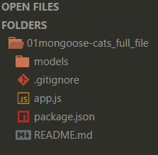
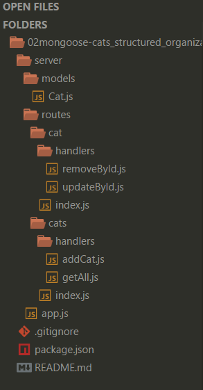

# Today 24.05

### [Mongoose](http://mongoosejs.com/)

Continuing with mongoose, today review the structure folders for a project.

Here one example before and after for the structure:

1. Before structure, all in one file.

2. After with structure organization.

Here you can see the exercises the example that do you can see.

1. [Before structure, all in one file.](01mongoose-cats_full_file)
1. [After with structure organization.](02mongoose-cats_structured_organization)

