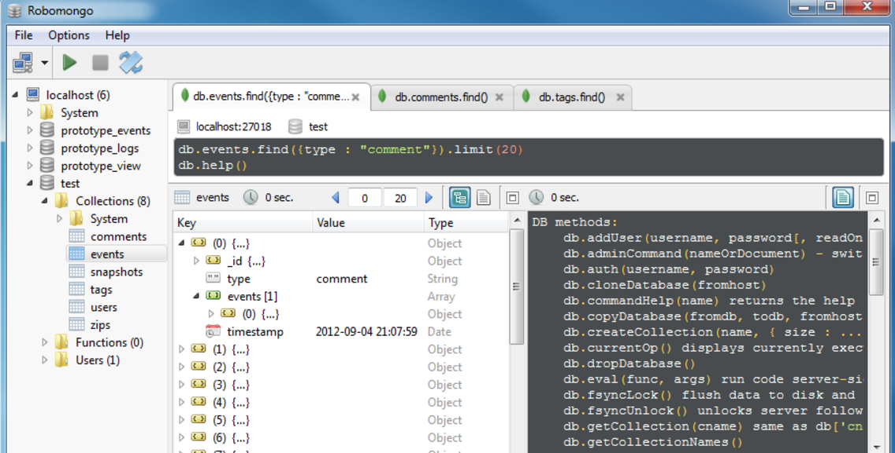

# Today 25/05 

## Useful tools.

### [Robomongo](https://robomongo.org/)

MongoDB manager

The Robomongo is for to show in interface graphic instead command line.

### [Devtools](https://www.npmjs.com/package/devtool)

Runs Node.js programs inside Chrome DevTools (using Electron).

- In command line:
    + For install like any npm module
        * ``npm install devtool -g``
    + After to install un this command
        * ``devtool server/app --watch``

Run the command to open a new DevTools window.

**Usage**: [here more commands](https://www.npmjs.com/package/devtool#usage)
  devtool [entry] [opts]
 

### [Debug npm](https://www.npmjs.com/package/debug)

Another tool only as part of the application is [debug](https://www.npmjs.com/package/debug):.

``npm install debug --save``

``set DEBUG=* npm run dev`` the asterics is for show all

``npm run dev``

this utility is to watch constantly the different routes of our project and that happen.

Usage and more information [here](https://www.npmjs.com/package/debug#usage).

---

**Remember**.

* req.body all information get of form (is necessary the body-parser)
* req.params all information about URL (ex. /employess/:id)
* req.query all information about URL (ex. /employees?name)
