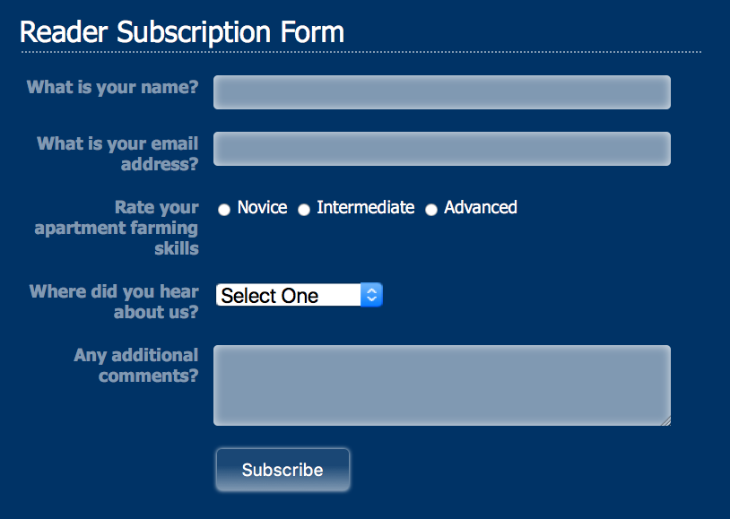
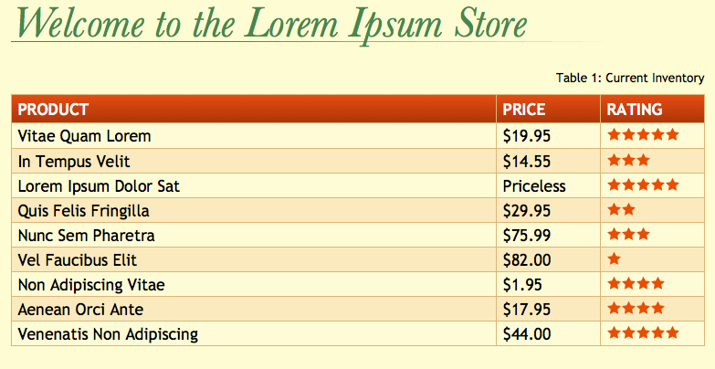

# Challenge: Forms & Tables

##1. Forms

Add the proper CSS styles so `form/form.html` appears in the browser with the following design.  

_Note: add proper classes to the HTML if needed_  

##2. Table

Add the proper CSS styles so `table/table.html` appears in the browser with the following design.  

_Note: add proper classes to the HTML if needed_  

