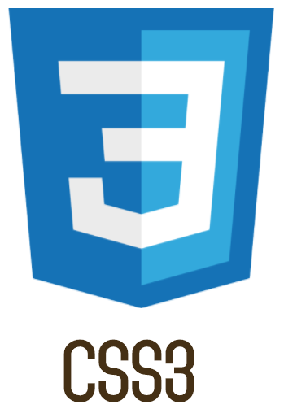
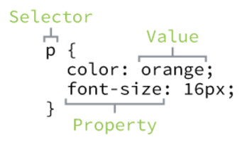
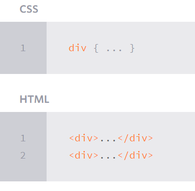

# Today 18.04

# [CSS3](https://skylabcoders.github.io/bootcamp-abril2017/?full#css3)
## CSS3 Basics & Selectors

[](https://skylabcoders.github.io/bootcamp-abril2017/?full#css3)

Is the layer of the presentation and design.

El css se construye con una serie de reglas donde definimos
un selector y una serie de pares (propiedad y valor).

*There are three ways* 
1.  In line of HTML document, no recomended
2.  Tag style into HTML document
3.  Recomended, link file extern


-   selector propiedad:valor (*``p {color:red}``*)
    
**Type Selectors**
-   Tags elements of the HTML
    
**Class Selectors**
-   Dot selector  (``.``) select particular group of elements.
     
**Id selectors**
    + Class selector (``#``) Only select the element containing the id attribute value.
     

---

**The diferences between**:
-   The id should be unique. Only one description for once.
-   The class are share.

## Specificity 
*(preferences into CSS3)*
The first is in cascade, after the ID, class and tag.

[Specificity Calculator](https://specificity.keegan.st/)


# Complex Selectors

[Common Selector overview](http://learn.shayhowe.com/advanced-html-css/complex-selectors/)


**Child Selectors Overview**


**Sibling Selectors Overview**


## CSS3 Properties & Values

[CSS3 Properties & Values](https://skylabcoders.github.io/bootcamp-abril2017/?full#83):

-   Fonts: 
    * Working width typography
    * Font Family (``font-family:``)
    * Color text: (``color:``)
    * Font weight

## CSS3 Positioning
[link to slide](https://skylabcoders.github.io/bootcamp-abril2017/?full#85)

**The Box Model** is the sum of width, height, padding, margin, border.


- Using the formulas, we can find the total height and width of our example code.

**Width**: 492px = 20px + 6px + 20px + 400px + 20px + 6px + 20px
**Height**: 192px = 20px + 6px + 20px + 100px + 20px + 6px + 20px

Natural flow empujara al resto de cajas.
Width display command you can modify his possition

Los elementos de bloque ocupan el 100% y saltan de linea empujando el resto de elementos.
Display hibryd for modifed things. ``display: inline-block`` coloca cada bloque en linea (uno al lado del otro).

Después tenemos otro importante que es el ``float`` hacemos que el texto flote alrededor. Sirve para posicionar cajas en el layout.

# Esquema del HTML5+CSS3

-   Section:
    *   Used for grouping together thematically-related content. Sounds like a div element, but its not. The div has no semantic meaning. Before replacing all your div’s with section elements, always ask yourself, “Is all of the content related?”

-   Aside:
    *   Used for tangentially related content. Just because some content appears to the left or right of the main content isn’t enough reason to use the aside element. Ask yourself if the content within the aside can be removed without reducing the meaning of the main content. Pullquotes are an example of tangentially related content.
-   Header:
    *   There is a crucial difference between the header element and the general accepted usage of header (or masthead). There’s usually only one header or ‘masthead’ in a page. In HTML5 you can have as many as you want. The spec defines it as “a group of introductory or navigational aids”. You can use a header in any section on your site. In fact, you probably should use a header within most of your sections. The spec describes the section element as “a thematic grouping of content, typically with a heading.”
-   Nav:
    *   Intended for major navigation information. A group of links grouped together isn’t enough reason to use the nav element. Site-wide navigation, on the other hand belongs in a nav element.
-   Footer:
    *   Sounds like its a description of the position, but its not. Footer elements contain information about it’s containing element: who wrote it, copyright, links to related content, etc. Whereas we usually have one footer for an entire document, HTML5 allows us to also have footer within sections.

##  Float

[Ejemplos](http://learn.shayhowe.com/html-css/positioning-content/) float:


*codigo*:

```css
}
header,
section,
aside,
footer {
  margin: 0 1.5% 24px 1.5%;
}
section {
  float: left;
  width: 63%;
}
aside {
  float: right;
  width: 30%;
}
footer {
  clear: both;
  margin-bottom: 0;
}
```

---


[Exercises](https://skylabcoders.github.io/bootcamp-abril2017/?full#95)

[Solution Selector](HTML5+CSS3 Challenges/2-selectors/materials/exercise1.html)
[Solution Float](HTML5+CSS3 Challenges/3-floats/index.html)
[Solution Layout](HTML5+CSS3 Challenges/4-layout/index.html)


