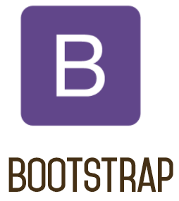

# Today 20.04

# [Bootstrap](https://skylabcoders.github.io/bootcamp-abril2017/?full#bootstrap) 

[](https://skylabcoders.github.io/bootcamp-abril2017/?full#bootstrap)

First all [downloaded](https://skylabcoders.github.io/bootcamp-abril2017/?full#98):

[Download it](http://getbootstrap.com/) or use at via [CDN](http://getbootstrap.com/getting-started/#download-cdn) without download.
CDN --> Content Delivery Network

Al trabajar con **Bootstrap** siempre debemos de poner la libreria de **JQuery** junto con la propia libreria .js de Bootstrap.

Hay varios [templates](https://skylabcoders.github.io/bootcamp-abril2017/?full#98) para poder empezar rápido
[http://getbootstrap.com/getting-started/#template ](http://getbootstrap.com/getting-started/#template), tambien buscando por Googlee


Tambien responsive first, a traves del grid con distintos tamaños de pantalla (View Port)
[Grid options](http://getbootstrap.com/css/#grid-options)


## [Grids](http://getbootstrap.com/css/#grid)
Bootstrap trabaja mediante [grids](http://getbootstrap.com/css/#grid).
Un sistema de rejilla de 12 columnas.
Mas [info](https://scotch.io/tutorials/understanding-the-bootstrap-3-grid-system) para entender el sistema de rejilla.


*   Introduction
*   Media queries
*   Grid options
*   Ex: Stacked-to-horizontal
*   Ex: Fluid container
*   Ex: Mobile and desktop
*   Ex: Mobile, tablet, desktop
*   Ex: Column wrapping
*   Responsive column resets
*   Offsetting columns
*   Nesting columns
*   Column ordering
*   Less mixins and variables

## [Type](http://getbootstrap.com/css/#type)


Tambien tenemos apartado de [Type](http://getbootstrap.com/css/#type), donde podemos personalizar:

*   Headings
*   Body copy
*   Inline text elements
*   Alignment classes
*   Transformation classes
*   Abbreviations
*   Addresses
*   Blockquotes
*   Lists

## More options:

[Tables](http://getbootstrap.com/css/#tables)

[Forms](http://getbootstrap.com/css/#forms)

[Buttons](http://getbootstrap.com/css/#buttons)

[Images](http://getbootstrap.com/css/#images)

[Helper classes](http://getbootstrap.com/css/#helper-classes)

[Responsive utilities](http://getbootstrap.com/css/#responsive-utilities)

[Using Less](http://getbootstrap.com/css/#less)

[Using Sass](http://getbootstrap.com/css/#sass)

## [Components](http://getbootstrap.com/components/)

So we have more dozen reusable components into Bootstrap.

For add any icon into our project we use ```<i>.. </i>``` tag.

## [JavaScript](http://getbootstrap.com/javascript/)

Se ha de cargar la libreria de **bootstrap** y la libreria de **jquery**

## More resources

Resources into the course [slide](https://skylabcoders.github.io/bootcamp-abril2017/?full#100)

[Bootstrap Site Exercise](https://github.com/juanmaguitar/bootstrap-exercises)

Bootstrap examples:

[Demo-bootstrap from Juanma](examples/demo-bootstrap.html)
[Demo Example Media Query from Juanma](examples/example_media-query.html)
[Demo Responsive Design Header from Juanma](examples/responsive-design-header.html)
