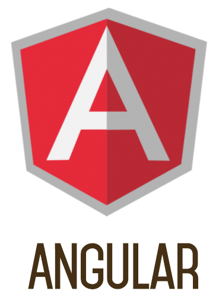
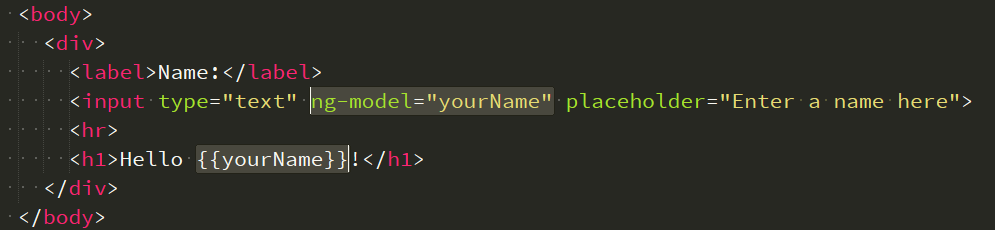

## Today 27.04 


Review of exercices of yestarday and today one more.

Beers App :)

[Demo Beers App](Demo Beers App/index.html)




## [Angular definition](https://skylabcoders.github.io/bootcamp-abril2017/?full#angular)

Libreria, la puedas cargar y utilizar o no.
Y el framework es obligatorio.

Angular es un Framework y se ha de seguir sus reglas.
Provee una estructura de trabajar en pequeños trozos, así en un proyecto grande es mas facil poder controlarlo.

**Angular es extructural**.

Patrones:
    - Model (todo nuestro código)
    - Controler ()
    - View (todo lo que tenga que ver con la vista)

## Model view controller


## MVVM pattern

**M**odel **V**iew **V**iew **M**odel:

- View
- View-model
- Model

Para comunicar entre diferentes structuras se utiliza el ``$scope``

Ejemplo una vez cargado Angular:



Con este proceso realizamos todo el proceso automáticamente. El HTML lee directamente del ``$scope`` de Angular, *no es lo mismo que el scope de las variables* y para mostar datos al HTML debemos asociar nuestro código resultante con ``$scope.student = student``;

Las variables se identifica entre las llaves ``{}`` y el ``ng-model="yourName"`` invocamos la estructura de Angular que realiza el cambio directamente.

## Modules Angular

angular.module("mainApp",[]);

Un modulo es como un contenedor de cosas de Angular necesita.

## Controler

Controladores que usa Angular asociados a un módulo y definen algún bloque del HTML.
```
angular.module('myControllersContainer',[])
.controller('MyController',function($scope){
    console.log("....")
})
```

## Directivas

- ng-app
- ng-controller
- ng-model
- ng-repeat
- ng-show
- ng-hide


Ejemplos ejercicios Angular:

-  [Beatles.html](angular-demo-app/beatles.html)
-  [Beatles Angular Pro](angular-demo-app/beatles_angular_pro.html)
-  [Demo](angular-demo-app/index.html)
  


