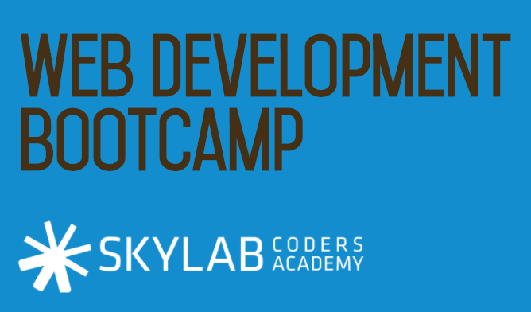
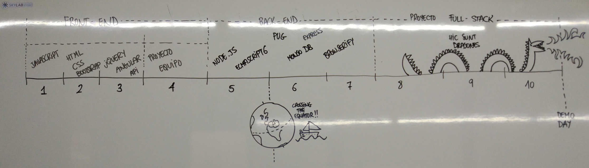

# My experience at Bootcamp SkyLabCoders

## Start at 10/04/2017 and finished 16/06/2017

### [Full Stack Web Development Bootcamp](https://skylabcoders.github.io/bootcamp-abril2017/)

Progression resume:

---

-   [Tips](https://github.com/tonimg/Course/blob/master/Tips/tips.md#tips) resume folder.
-   Resume [first week and exercices](https://github.com/tonimg/Course/blob/master/Frontend/Frontend/01%20Semana/Readme%2010.04.md) - 10/04/2017.
    +   [Basics Commands Cmender](https://github.com/tonimg/Course/blob/master/Frontend/01%20Semana/Readme%2010.04.md#basics-commands-cmendercommands-httpblikergithubiocmder)
    +   [Bacis Commands Markdown](https://github.com/tonimg/Course/blob/master/Frontend/01%20Semana/Readme%2010.04.md#bacis-commands-markdown)
    +   [Repositorios y trabajar con GIT local](https://github.com/tonimg/Course/blob/master/Frontend/01%20Semana/Readme%2010.04.md#repositorios-y-trabajar-con-git-local)
    +   [Comandos utilies Git](https://github.com/tonimg/Course/blob/master/Frontend/01%20Semana/Readme%2010.04.md#comandos-utilies-git)
    +   [Repositorio remoto GitHub(Cloud)](https://github.com/tonimg/Course/blob/master/Frontend/01%20Semana/Readme%2010.04.md#repositorio-remoto-github-en-la-nube) 
    +   [Social Media](https://github.com/tonimg/Course/blob/master/Frontend/01%20Semana/Readme%2011.04.md#social-media)
    +   [Programación JavaScript web development](https://github.com/tonimg/Course/blob/master/Frontend/01%20Semana/Readme%2011.04.md#programación-js-web-development)
        *   [Definiciones](https://github.com/tonimg/Course/blob/master/Frontend/01%20Semana/Readme%2011.04.md#definiciones)
        *   [Tipos de variables](https://github.com/tonimg/Course/blob/master/Frontend/01%20Semana/Readme%2011.04.md#tipos-de-variables)
        *   [Funciones y funciones anónimas](https://github.com/tonimg/Course/blob/master/Frontend/01%20Semana/Readme%2012.04.md#funciones-y-funciones-anónimas)
        *   [Arguments](https://github.com/tonimg/Course/blob/master/Frontend/01%20Semana/Readme%2012.04.md#argument)
        *   [Arrays & Objects](https://github.com/tonimg/Course/blob/master/Frontend/01%20Semana/Readme%2012.04.md#arrays--objects)
            -   [Exercices](https://github.com/tonimg/Course/blob/master/Frontend/01%20Semana/Readme%2013.04.md#practice)
        *   [Metodos de array](https://github.com/tonimg/Course/blob/master/Frontend/01%20Semana/Readme%2013.04.md#metodos-de-array-podemos-hacer)
        *   [Prototype](https://github.com/tonimg/Course/blob/master/Frontend/01%20Semana/Readme%2013.04.md#prototype)
        *   [Methods of regulars expresions objets](https://github.com/tonimg/Course/blob/master/Frontend/Frontend/Frontend/02%20Semana/Readme%2017.04.md#methods-of-the-regexp-objects)
        *   [Syntax regular expressions](https://github.com/tonimg/Course/blob/master/Frontend/Frontend/Frontend/02%20Semana/Readme%2017.04.md#syntax-regular-expression)
-   Resume [second week and exercices](https://github.com/tonimg/Course/tree/master/Frontend/02%20Semana) - 17/04/2017.
    +   [HTML](https://github.com/tonimg/Course/blob/master/Frontend/02%20Semana/Readme%2017.04.md#html)
        *   [Bacis tags](https://github.com/tonimg/Course/blob/master/Frontend/02%20Semana/Readme%2017.04.md#diferentes-tags-de-un-html-5)
        *   [Forms](https://github.com/tonimg/Course/blob/master/Frontend/02%20Semana/Readme%2017.04.md#creación-formularios)
        *   Layouts
    +   [CSS3](https://github.com/tonimg/Course/blob/master/Frontend/02%20Semana/Readme%2018.04.md#css3)
        *   [CSS3 Basics & Selectors](https://github.com/tonimg/Course/blob/master/Frontend/02%20Semana/Readme%2018.04.md#css3-basics--selectors)
        *   [Specificity](https://github.com/tonimg/Course/blob/master/Frontend/02%20Semana/Readme%2018.04.md#specificity)
        *   [Complex Selectors](https://github.com/tonimg/Course/blob/master/Frontend/02%20Semana/Readme%2018.04.md#complex-selectors)
        *   [CSS3 Properties & Values](https://github.com/tonimg/Course/blob/master/Frontend/02%20Semana/Readme%2018.04.md#css3-properties--values)
        *   [Positioning CSS3](https://github.com/tonimg/Course/blob/master/Frontend/02%20Semana/Readme%2018.04.md#css3-positioning)
        *   [Esquema del HTML5+CSS3](https://github.com/tonimg/Course/blob/master/Frontend/02%20Semana/Readme%2018.04.md#esquema-del-html5css3)
        *   [Float](https://github.com/tonimg/Course/blob/master/Frontend/02%20Semana/Readme%2018.04.md#float)
        *   [Block elements & Inline elements](https://github.com/tonimg/Course/blob/master/Frontend/02%20Semana/Readme%2019.04.md#block-elements-and-inline-elements)
        *   [Flex Box](https://github.com/tonimg/Course/blob/master/Frontend/02%20Semana/Readme%2019.04.md#flex-box)
        *   [Flex Properties](https://github.com/tonimg/Course/blob/master/Frontend/02%20Semana/Readme%2019.04.md#flex-property)
        *   [Media Query](https://github.com/tonimg/Course/blob/master/Frontend/02%20Semana/Readme%2019.04.md#css3-mediaquery)
    *   [Bootstrap](https://github.com/tonimg/Course/blob/master/Frontend/02%20Semana/Readme%2020.04.md)
    *   [Sass](https://github.com/tonimg/Course/blob/master/Frontend/02%20Semana/Readme%2021.04.md#sass)
-   Resume [third week and exercices](https://github.com/tonimg/Course/tree/master/Frontend/03%20Semana) - 24/04/2017.
    -  [JQuery](https://github.com/tonimg/Course/blob/master/Frontend/03%20Semana/Readme%2024.04.md#jquery)
        +  [BOM](https://github.com/tonimg/Course/blob/master/Frontend/03%20Semana/Readme%2024.04.md#bom)
        +  [Window Methods](https://github.com/tonimg/Course/blob/master/Frontend/03%20Semana/Readme%2024.04.md#window-methods)
        +  [DOM](https://github.com/tonimg/Course/blob/master/Frontend/03%20Semana/Readme%2024.04.md#dom)
        +  [Manipulating Elements](https://github.com/tonimg/Course/blob/master/Frontend/03%20Semana/Readme%2024.04.md#manipulating-elements)
        +  [Moving, Copying, and Removing Elements](https://github.com/tonimg/Course/blob/master/Frontend/03%20Semana/Readme%2024.04.md#moving-copying-and-removing-elements)
        +  [Parents - Children - Siblings](https://github.com/tonimg/Course/blob/master/Frontend/03%20Semana/Readme%2024.04.md#parents)
        +  [jQuery Events](https://github.com/tonimg/Course/blob/master/Frontend/03%20Semana/Readme%2025.04.md#jquery-events)
        +  [More explanation about Event](https://github.com/tonimg/Course/blob/master/Frontend/03%20Semana/Readme%2026.04.md#today-2604)
    -  [JSON](https://github.com/tonimg/Course/blob/master/Frontend/03%20Semana/Readme%2026.04.md#json)
    -  [AJAX](https://github.com/tonimg/Course/blob/master/Frontend/03%20Semana/Readme%2026.04.md#ajax)
    -  [API](https://github.com/tonimg/Course/blob/master/Frontend/03%20Semana/Readme%2026.04.md#api)
    -   [Angular](https://github.com/tonimg/Course/blob/master/Frontend/03%20Semana/Readme%2027.04.md#today-2704)
        +  [Model view controller](https://github.com/tonimg/Course/blob/master/Frontend/03%20Semana/Readme%2027.04.md#model-view-controller)
        +  $scope, [controllers](https://github.com/tonimg/Course/blob/master/Frontend/03%20Semana/Readme%2027.04.md#controler), templates, factory, service.
        +  [Routing](https://github.com/tonimg/Course/blob/master/Frontend/04%20Semana/Readme%2001.05.md#today-0105), API calls | Services
        +  [**S**ingle **P**age **A**pplication](https://github.com/tonimg/Course/blob/master/Frontend/03%20Semana/Readme%2028.04.md#spa)

----------------------------------------

-   [Fourth week](https://github.com/tonimg/Course/tree/master/Frontend/04%20Semana) - ¡¡¡Proyects!!! - 
    +   **List proyects team**: 
    
        +   League of Comics
            *   Members : Yair, Jose Angel & Sergio
GitHub: https://github.com/joseangelbarrera/leagueOfComics
Online: https://joseangelbarrera.github.io/leagueOfComics/#/
        +   Movie World
            *   Members : Jaume, Luis Alberto & Simon
GitHub: https://github.com/lfernandezcall/movie_world
Online: https://lfernandezcall.github.io/movie_world/#/
        +   **Gas Station Apps**
            *   Members: **Toni**, Nuria & Leo
Github: https://github.com/tonimg/GasStationApp
Online: https://tonimg.github.io/GasStationApp/#/
        +   Fly to Barcelona
            *   Members: Bernat, Wally & Carles
Github: https://github.com/picapoll/fly_to_barcelona
Online: https://picapoll.github.io/fly_to_barcelona/#/
        +   Eat Out
            *   Members: Mario, Gus & Jordi
Github: https://github.com/MarioTerron/eat-out
Online: https://marioterron.github.io/eat-out/#/

**End Frontend**

----------------

**Star the Backend**

-   Resume [five week and exercices](https://github.com/tonimg/Course/tree/master/Backend/05%20Semana) - 07/05/2017.
    +   [NodeJS](https://skylabcoders.github.io/bootcamp-abril2017/?full#207)
        *   [NPM](https://github.com/tonimg/Course/blob/master/Backend/05%20Semana/Readme%2008.05.md#npm)
        *   [Exercises](https://skylabcoders.github.io/bootcamp-abril2017/?full#213)
        *   [Modulos node](https://github.com/tonimg/Course/blob/master/Backend/05%20Semana/Readme%2009.05.md#modulos-node-require) (require)
        *   [HTML Code](https://github.com/tonimg/Course/blob/master/Backend/05%20Semana/Readme%2009.05.md#html-code)
        *   [Exercices](https://github.com/tonimg/Course/blob/master/Backend/05%20Semana/Readme%2009.05.md#exercices)
        *   Request - Simplified HTTP client  
        *   Asynchronous programming in Node
        *   [Asynchronous programming in NodeJS](https://github.com/tonimg/Course/blob/master/Backend/05%20Semana/Readme%2009.05.md#asynchronous-programming-in-node)
        *   Streams
        *   Exercices
    +   [ECMAScript 2015](https://github.com/tonimg/Course/blob/master/Backend/05%20Semana/Readme%2011.05.md#ecmascript-2015)
        *   [Arrow Functions](https://github.com/tonimg/Course/blob/master/Backend/05%20Semana/Readme%2011.05.md#arrow-functions)
        *   [Block Scope](https://github.com/tonimg/Course/blob/master/Backend/05%20Semana/Readme%2011.05.md#block-scope) (Let - Const)
        *   [Template Strings](https://github.com/tonimg/Course/blob/master/Backend/05%20Semana/Readme%2011.05.md#template-strings)
        *   [IIFE](https://github.com/tonimg/Course/blob/master/Backend/05%20Semana/Readme%2011.05.md#iife) (**I**mmediately-**i**nvoked **f**unction **e**xpression)
        *   [Enhanced Object Literals](https://github.com/tonimg/Course/blob/master/Backend/05%20Semana/Readme%2011.05.md#enhanced-object-literals)
        *   [Default parameters](https://github.com/tonimg/Course/blob/master/Backend/05%20Semana/Readme%2011.05.md#default-parameters)
        *   [Destructuring](https://github.com/tonimg/Course/blob/master/Backend/05%20Semana/Readme%2011.05.md#destructuring)
        *   [Rest operator](https://github.com/tonimg/Course/blob/master/Backend/05%20Semana/Readme%2011.05.md#rest-operator)
        *   [Spread operator](https://github.com/tonimg/Course/blob/master/Backend/05%20Semana/Readme%2011.05.md#spread-operator)
        *   [Promises](https://github.com/tonimg/Course/blob/master/Backend/05%20Semana/Readme%2012.05.md#promises)
    +   [TDD](https://github.com/tonimg/Course/blob/master/Backend/05%20Semana/Readme%2013.05.md#tdd) && [BDD](https://github.com/tonimg/Course/blob/master/Backend/05%20Semana/Readme%2013.05.md#bdd)
        *   [Testing Frameworks](https://github.com/tonimg/Course/blob/master/Backend/05%20Semana/Readme%2013.05.md#testing-frameworks)
        *   [KATA](https://github.com/tonimg/Course/blob/master/Backend/05%20Semana/Readme%2013.05.md#kata)

-   Resume [Sixth week and exercices](https://github.com/tonimg/Course/tree/master/Backend/06%20Semana) - 15/05/2017.
    +   [Express.js](https://github.com/tonimg/Course/blob/master/Backend/06%20Semana/Readme%2015.05.md#today-1505)
        +   [CURL](https://github.com/tonimg/Course/blob/master/Backend/06%20Semana/Readme%2015.05.md#curl)
        +   [Bower](https://github.com/tonimg/Course/blob/master/Backend/06%20Semana/Readme%2015.05.md#bower)
        +   [Exercices](https://github.com/tonimg/Course/blob/master/Backend/06%20Semana/Readme%2015.05.md#exercices)

Copyright © 2017 Toni.
