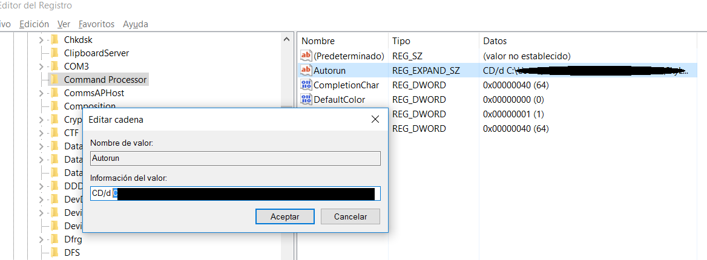

# Tips 

## Sublime Text 3

### Plugins Sublime:

Paste the above into your command line prompt and this will make the **subl** command available to you.

If you are using Sublime Text 3 with a shortcut, use the following instead from Cmder:

``doskey subl="C:\Program Files\Sublime Text 3\sublime_text.exe" $*``

### Add console

 **Como poner la consola integrada en Sublime Text 3**

 ya tenia Node.js instalado por lo que seguí estás instrucciones, si no lo tienes instalado, tarde o temprano te hará falta, instalalo de la siguiente url: *[https://nodejs.org/es/](https://nodejs.org/es/)*.
 Continuando como que ya lo tenemos instalado hacemos lo siguiente:
   - Vamos a **Tools --> Build system --> New Build System** del menú superior.
   - Se nos abrirá una ventana nueva donde debemos de escribir esto:

```
{
"cmd": ["node", "$file"],
"selector": "source.js"
}

```

- Después le damos a guardar como en **File --> Save As...** y nos aseguramos de guardarlo en la carpeta user por defecto, que suele parecerse a: **C:\Users\tunombre\AppData\Roaming\Sublime Text 3\Packages\User** con el nombre que queramos, yo por ejemplo he puesto "*Console*". Ya tienes creado tu primer "*build system*".
- Ahora, para usarlo, abrimos nuestro archivo .js vamos a **Tools --> Build system --> Console**.
- También puedes utilizar la combinación de teclas **Ctrl+B** en windows os **Command + B** en Mac.

***Información extraida de [http://www.wikihow.com/Create-a-Javascript-Console-in-Sublime-Text](http://www.wikihow.com/Create-a-Javascript-Console-in-Sublime-Text)***

**[Sublime keybind from to the Cmder terminal](https://github.com/tonimg/Course/blob/master/Tips/tips.md#terminal-cmder-path-default)**

### My package installs of Sublime:

-   Bootstrap 3 Snippet.
-   A File Icon
-   ColorPicker
-   AutoFileName
-   Autoprefixer
-   CSS3
-   Emmet
-   HTML-CSS.JS Prettify
-   LiveReload
-   Markdown Preview
-   MarkdownEditing
-   Sass
-   SulimeLinter
-   [Unsplash](https://unsplash.com/)
-   JavaScript Snippets
-   Pug
-   Console Wrap
-   [Boxy Theme](https://packagecontrol.io/packages/Boxy%20Theme)

## Chrome

### Extension I'm use for Chrome:

- [JSON Formatter](https://chrome.google.com/webstore/detail/json-formatter/bcjindcccaagfpapjjmafapmmgkkhgoa?hl=es)
- [LiveReload](https://chrome.google.com/webstore/detail/livereload/jnihajbhpnppcggbcgedagnkighmdlei)
- [ColorZilla](https://chrome.google.com/webstore/detail/colorzilla/bhlhnicpbhignbdhedgjhgdocnmhomnp)
- BootstrapGrip
- Clear Cache
- [Angular Chrome](https://chrome.google.com/webstore/detail/angular-chrome/fobloefinmdlpnanffefbpkkgflocmlp)
- PostMan
- [Octotree](https://chrome.google.com/webstore/detail/octotree/bkhaagjahfmjljalopjnoealnfndnagc/related?hl=en-US)

## Git & GitHub

### [Basic commands](https://github.com/tonimg/Course/blob/master/Frontend/01%20Semana/Readme%2010.04.md#basics-commands-cmdercommands-httpblikergithubiocmder)

- Steps to follow after generate the folder to work:

1.  *git init* (inicializamos proyecto git).
2.  *git add* (añadimos archivos).
3.  *git commit -m "y comentario descriptivo"*
4.  *git status* (saber el estado en el cual esta o estan los archivos).
5.  *git --all* para añadir y commitear todo.
6.  *git diff* te indica los cambios realizados.
7.  *git log* para historial de los commits del repositorio.
8.  Si tienes algún error al generar el git init (ejemplo, te equivocastes de directorio, usa este comando en el directorio erroneo ```rm -rf .git```)

 **Trabajar con proyectos en grupo con GitHub**

More information about [GitHub](https://github.com/tonimg/Course/blob/master/Frontend/01%20Semana/Readme%2011.04.md#acabando-con-git--github)

- ``git clone`` <- clonas repositorio remoto en local
- ``git push`` -> subes los cambios locales a remoto
- ``git pull`` <- actualiza las tablas locales y actualiza los archivos. *Realiza esás dos opciones. (``git Feth`` (actualiza tablas) + ``git Merge``(añade cambios))*

- ``git branch new_name`` (para crear ramas y ver ramas que hay creadas)
- ``git checkout new_name`` (para cambiar de rama y trabajar en ella.)
- ``git checkout master`` (para trabajar en la rama principal)

Para realizar un merge con la rama master, primero debemos de ir a la rama master y le decimos ``git merge new_name``

- ``git branch -d new_name`` -> (para borrar la rama)
- If we want ignored any file for Git, must be create a file whit the name ``.gitignore`` and into put the name of the folders and files for ignore the Git, in the same way there this explanation [web](https://www.gitignore.io/)

## [Cmder](http://bliker.github.io/cmder)

### Basics Commands

*Portable console emulator for Windows **[cmder](http://cmder.net/)***

### 

### Terminal Cmder path default

A neat way integrate [Cmder and Sublime](https://laravel.io/forum/02-24-2014-a-neat-way-integrate-cmder-and-sublime-text-seamlessly) text seamlessly.

Change directory by default ([here](https://www.youtube.com/watch?v=3bBSVXAdeXg)
Open Regedit --> *HKEY_LOCAL_MACHINE\SOFTWARE\Microsoft\Command Processor* and we will create a **new** "Reg_Expand_SZ" (*valor cadena expandible*) with the name ``Autorun`` with the value ``CD/d C:\Users\username\your\path\route``



-   ``cd`` for change directory
-   ``cd..`` up level directory
-   ``ls`` list contein
-   ``ls -a`` list contein + hidden files
-   ``ls  -la`` detalles archivos y carpetas
-   ``mkdir`` create folder directory
-   ``touch`` create directory
-   ``rmdir`` delete folder
-   ``rm -rf`` delete folder and files
-   ``mv 'filename1' 'C:\folder\filename2'`` move files or foldes


## Extras

- [Documentar código](https://jashkenas.github.io/docco/)
- Parsear webs [here](https://github.com/tonimg/Course/blob/master/Backend/05%20Semana/parsing_web.js) 


## Web Tools

- https://mockaroo.com/
    + Useful for created items and generated a .json file.

- http://www.jsoneditoronline.org/
    + Useful for check our .json file. 
